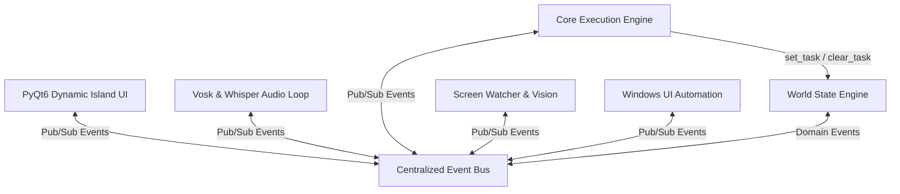
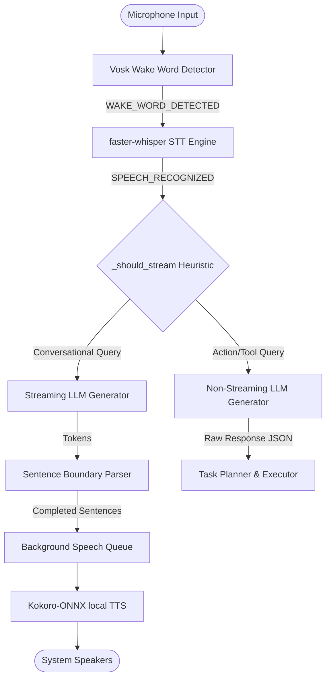
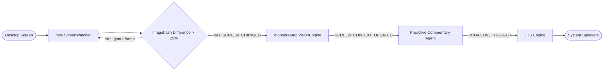
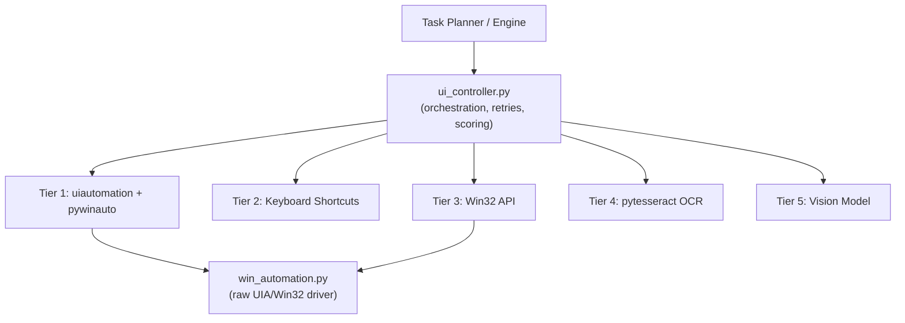
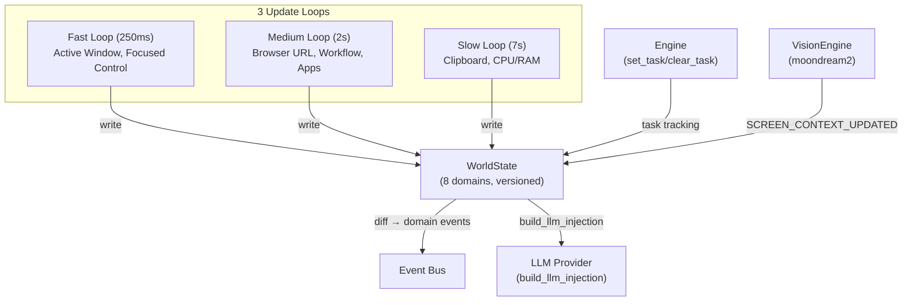
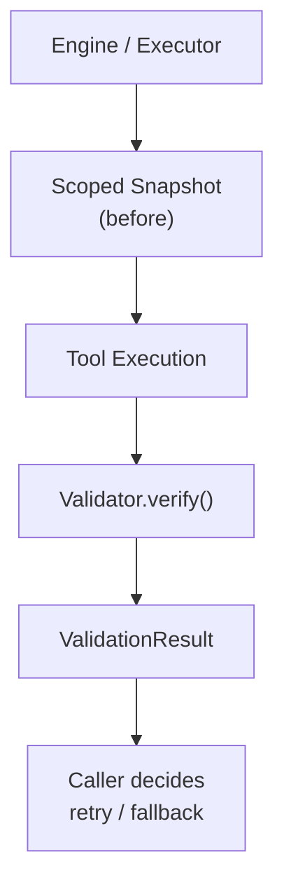
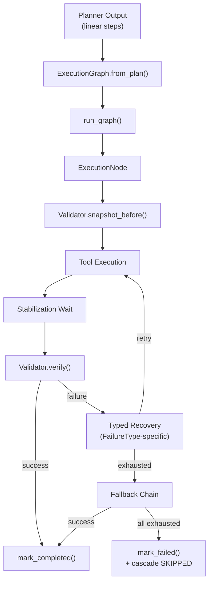

# Jarvis MK37 (v5.1) — Technical Architecture

This document describes the internal architecture of Jarvis v5.0. Jarvis is built on a **fully asynchronous, event-driven (publish/subscribe) architecture** to keep the user interface responsive while managing complex hardware operations (audio capture, screen watching, local neural inference, and OS automation) in parallel.

---

## 1. High-Level Architecture Overview

Rather than tightly coupling modules (e.g. making the Voice component call the UI component directly), every system component communicates through a centralized **Event Bus**. This design pattern is crucial: it allows any module to emit an event and any other module to register callbacks for that event.

---

## 2. The Event Bus Pattern

The event bus (`core/events.py`) implements a thread-safe Observer pattern. Key system events include:

| Category | Event Name | Source | Purpose |
|---|---|---|---|
| **FSM State** | `STATE_CHANGED` | `StateManager` | Syncs the PyQt6 Dynamic Island ring animation to the system's operational state. |
| **Voice Pipeline** | `WAKE_WORD_DETECTED` | `Vosk wake_word` | Triggers the main engine to transition to a listening state. |
| | `SPEECH_RECOGNIZED` | `faster-whisper STT` | Delivers transcribed user query text to the Planner. |
| | `LLM_TOKEN_RECEIVED` | `StreamingPipeline` | Emitted when a streaming chunk is received from the LLM. |
| **Vision & Screen**| `SCREEN_CHANGED` | `ScreenWatcher` | Broadcasts when perceptual screen difference exceeds 25%. |
| | `SCREEN_CONTEXT_UPDATED` | `VisionEngine` | Sends a text description of the screen computed by `moondream2`. |
| | `PROACTIVE_TRIGGER` | `ProactiveAgent` | Fired when the agent decides to speak without prompt. |
| **Automation** | `ELEMENT_FOUND` | `win_automation` | Fired when a targeted Windows UI element is matched in the accessibility tree. |
| | `ACTION_STARTED` / `FAILED` | `Executor` | Tracks task execution progress and triggers re-planning on errors. |
| **World State** | `WINDOW_CHANGED` | `WorldState` fast loop | Active window title or exe changed. |
| | `ACTIVE_CONTROL_CHANGED` | `WorldState` fast loop | Focused UI control changed. |
| | `BROWSER_URL_CHANGED` | `WorldState` medium loop | Chrome URL changed. |
| | `CLIPBOARD_CHANGED` | `WorldState` slow loop | Clipboard text changed (sensitive content redacted). |
| | `WORKFLOW_CHANGED` | `WorldState` medium loop | Primary workflow probability shifted. |
| | `RUNNING_APPS_CHANGED` | `WorldState` medium loop | Running apps list changed. |

---

## 3. The Voice Loop & Streaming Pipeline

The voice loop is built to minimize latency. Traditional voice pipelines wait for the LLM to generate the entire response before starting TTS, resulting in a ~2.8s delay. Jarvis v5.0 implements a **streaming sentence parser** that pipes sentences to the TTS queue *while* the LLM is still generating subsequent text.

### The Voice Pipeline Sequence:
1. **Wake-Word Detection:** `vosk` (using a limited grammar of `"jarvis"`, `"hey jarvis"`, `"okay jarvis"`) runs continuously on mic input.
2. **STT:** `faster-whisper` transcribes user speech locally.
3. **Routing:** `_should_stream()` determines if the query is conversational (uses streaming) or an action query (uses non-streaming tool calling).
4. **Streaming LLM:** `llm_stream()` receives tokens in real-time.
5. **Sentence Parser:** A boundary detector (`.!?` characters) segments tokens into complete sentences.
6. **TTS Worker:** A background consumer thread takes sentences and generates audio using `kokoro-onnx` local neural speech, playing it instantly.

---

## 4. Screen Watcher & Proactive AI Loop

Jarvis is aware of what you are doing on your screen. A background pipeline captures screenshots and decides when to proactively speak to the user (e.g. noticing a build error, a finished task, or offering advice when the user is idle).

1. **Capture:** `ScreenWatcher` captures screenshots at 1fps using the high-performance `mss` library.
2. **Hashed Comparison:** `imagehash` calculates a perceptual hash. If the hash differs by more than 25% from the last frame, it emits `SCREEN_CHANGED`. This prevents continuous inference on a static screen, saving CPU/GPU cycles.
3. **Vision Processing:** `VisionEngine` inputs the screenshot into `moondream2` (a local 1.8B parameter vision model) to generate an image description.
4. **Proactivity Evaluation:** The `ProactiveAgent` processes the description and evaluates whether to speak based on "Interest Tiers" (Critical, Useful, Opinion) and rate limits (maximum 1 proactive comment per 45 seconds).

---

## 5. UI Automation — 5-Tier Execution Hierarchy (V5.1)

When Jarvis needs to interact with a desktop application, **all automation routes through `tools/ui_controller.py`** — the primary orchestration layer. It tries 5 methods in strict order, stopping at the first success:

1. **Tier 1 — UI Automation** (~10ms): Walk the accessibility tree via `uiautomation` + `pywinauto`. Uses `InvokePattern` (click buttons without coordinates), `ValuePattern` (set text directly), and `SelectionItemPattern` (switch tabs). Works on minimized windows.
2. **Tier 2 — Keyboard Shortcuts** (~5ms): 40+ built-in shortcuts (Ctrl+S, Alt+Tab, etc.). Bypasses the UI entirely.
3. **Tier 3 — Win32 API** (~5ms): Direct `win32gui` / `ctypes` window manipulation (EnumWindows, ShowWindow, SetForegroundWindow).
4. **Tier 4 — OCR** (~1s): `pytesseract` screen text matching. Works on custom-rendered UIs without accessibility trees.
5. **Tier 5 — Vision Fallback** (~3s): Screenshot → `moondream2` or Gemini Vision → coordinate click. Absolute last resort.

**The `ui_controller.py` orchestrates all of this** with retry logic, confidence scoring, and semantic element matching. The backend layer `win_automation.py` handles raw UIA/Win32 operations — it makes no decisions.

---

## 6. Directory Structure & Key Components

Here is a map of the repository's modules and their corresponding roles:

| Directory | Key Module | Description |
|---|---|---|
| `core/` | [events.py](file:///c:/Users/Siddharth%20Reddy/projects/jarvis/core/events.py) | Centralized event bus implementation. |
| | [engine.py](file:///c:/Users/Siddharth%20Reddy/projects/jarvis/core/engine.py) | Coordinates startup, event subscriptions, state machine transitions, and routing. |
| | [world_state.py](file:///c:/Users/Siddharth%20Reddy/projects/jarvis/core/world_state.py) | **World State Engine** — single source of truth for all system context. 8 domains, 3-speed loops, state diffing, workflow scoring, LLM injection. |
| | [validator.py](file:///c:/Users/Siddharth%20Reddy/projects/jarvis/core/validator.py) | **Validation Engine** — deterministic state transition verification. Confidence-scored, failure-typed, scoped-snapshot, field-level-diffing. |
| | [execution_graph.py](file:///c:/Users/Siddharth%20Reddy/projects/jarvis/core/execution_graph.py) | **Execution Graph Engine** — DAG-based multi-step execution with fallback chains, typed recovery, critical path cascading, partial success. |
| | [providers.py](file:///c:/Users/Siddharth%20Reddy/projects/jarvis/core/providers.py) | Cloud & local LLM API wrappers (Groq, Gemini, Ollama). Now injects WorldState context automatically. |
| | [stream_tts.py](file:///c:/Users/Siddharth%20Reddy/projects/jarvis/core/stream_tts.py) | Streaming LLM token consumer and sentence parsing thread. |
| | [tts.py](file:///c:/Users/Siddharth%20Reddy/projects/jarvis/core/tts.py) | Core text-to-speech implementation with Fallback: Kokoro-ONNX → edge-tts → pyttsx3. |
| | [stt.py](file:///c:/Users/Siddharth%20Reddy/projects/jarvis/core/stt.py) | Speech-to-text transcriber using local `faster-whisper`. |
| | [wake_word.py](file:///c:/Users/Siddharth%20Reddy/projects/jarvis/core/wake_word.py) | Vosk microphone audio hook listening for wake commands. |
| | [planner.py](file:///c:/Users/Siddharth%20Reddy/projects/jarvis/core/planner.py) & [executor.py](file:///c:/Users/Siddharth%20Reddy/projects/jarvis/core/executor.py) | Planner creates plans; executor is now a thin wrapper around ExecutionGraph. |
| | [terminal_observer.py](file:///c:/Users/Siddharth%20Reddy/projects/jarvis/core/terminal_observer.py) | **FIX 1A** — Monitors terminals for error patterns (Python, Node, Build, Git, Crash). Emits TERMINAL_ERROR_DETECTED, BUILD_FAILED, RUNTIME_EXCEPTION. |
| | [accessibility_observer.py](file:///c:/Users/Siddharth%20Reddy/projects/jarvis/core/accessibility_observer.py) | **FIX 1B** — Monitors accessibility tree for dialogs, modals, notifications, permission prompts. Emits DIALOG_DETECTED, DIALOG_DISMISSED. |
| `screen/` | [watcher.py](file:///c:/Users/Siddharth%20Reddy/projects/jarvis/screen/watcher.py) | **V5.1 FALLBACK** — Conditional capture at 0.2fps. Delegates to vision.py's 2-tier sufficiency gate. |
| | [vision.py](file:///c:/Users/Siddharth%20Reddy/projects/jarvis/screen/vision.py) | **V5.1 CONDITIONAL** — 2-tier gate: Tier 1 known-app whitelist + Tier 2 capability-based sufficiency scoring. |
| | [proactive.py](file:///c:/Users/Siddharth%20Reddy/projects/jarvis/screen/proactive.py) | Logic rules for spontaneous AI speech triggers. |
| `tools/` | [ui_controller.py](file:///c:/Users/Siddharth%20Reddy/projects/jarvis/tools/ui_controller.py) | **Primary UI orchestration layer** — 5-tier cascade (UIA → Keyboard → Win32 → OCR → Vision). |
| | [win_automation.py](file:///c:/Users/Siddharth%20Reddy/projects/jarvis/tools/win_automation.py) | Backend driver — raw UIA/Win32 operations (stable, low-level). |
| `ui/` | [dynamic_island.py](file:///c:/Users/Siddharth%20Reddy/projects/jarvis/ui/dynamic_island.py) | Native borderless PyQt6 always-on-top floating island overlay. |
| `actions/` | *Various files* | Executable system utilities for launching apps, file operations, web searches, and volume changes. |

---

## 7. World State Engine — Data Flow (V5.1)

The World State Engine (`core/world_state.py`) is **the single source of truth** for all system context. Every module reads from it; only the 3 update loops and the engine's task tracking write to it.

### Concept: Observer Pattern + Periodic Polling

WorldState combines **event-driven updates** (from the bus — vision context, action lifecycle) with **periodic polling** (from 3 background threads — active window, clipboard, running apps). Polling covers things the OS doesn't emit events for.

### Data Flow Diagram

### State Diffing

Each loop cycle:
1. **Snapshot** the current state.
2. **Run** the domain-specific update function.
3. **Diff** the snapshot against the new state.
4. **Emit** granular domain events only for changed domains.
5. **Increment** version counter and timestamp.

This ensures modules only react to actual changes — no noise, no wasted CPU.

---

## 8. Validation Engine — Observe → Execute → Verify (V5.1)

The Validation Engine (`core/validator.py`) is a **deterministic state transition verifier**. It does NOT retry, does NOT orchestrate, does NOT use AI reasoning. It answers one question: **"Did the expected state transition occur?"**

### Concept: State Transition Engineering

Instead of "did the tool return success?", we check "did the system state actually change in the way we expected?". This catches:
- **Silent failures** — tool returned OK but nothing happened
- **Wrong targets** — clicked the wrong button
- **Partial success** — app opened but didn't focus
- **Environmental interference** — another window stole focus

### Data Flow Diagram

### ValidationResult Structure

| Field | Type | Description |
|-------|------|-------------|
| `success` | bool | Did the action achieve its goal? |
| `confidence` | float | 0.0–1.0, calibrated per verification method |
| `verification_method` | str | world_state, uia, process, result_parse, ocr, vision |
| `failure_type` | FailureType | Typed failure for recovery routing |
| `changed_domains` | list | Which WorldState domains changed |
| `changed_fields` | list | Exact field paths that changed |

### Failure Type → Recovery Strategy

| FailureType | Recovery Action |
|-------------|----------------|
| `not_found` | OCR fallback, alternative target |
| `state_unchanged` | Retry, escalate verification method |
| `permission_denied` | Run as admin or abort |
| `focus_lost` | Refocus window and retry |
| `timeout` | Increase wait, retry |
| `ambiguous_match` | Disambiguate (add window filter) |
| `wrong_state` | Different approach entirely |

---

## 9. Execution Graph Engine — DAG-Based Execution (V5.1)

The Execution Graph Engine (`core/execution_graph.py`) replaces the linear step-loop in `executor.py` with a **DAG-based execution model**. Each plan step becomes an `ExecutionNode` with fallback chains, typed recovery, and stabilization windows.

### Concept: Goals, Not Steps

Each node represents a **goal** ("type hello into the search box"), not a tool call. The primary tool is the preferred mechanism, but the fallback chain provides alternatives. This means a node can succeed via keyboard shortcut even if UIA clicking fails.

### Data Flow Diagram

### Fallback Chain Example

| Primary | Fallback 1 | Fallback 2 | Fallback 3 |
|---------|-----------|-----------|------------|
| `type_text("hello")` | `computer_control(type, "hello")` | `clipboard(paste, "hello")` | — |
| `open_app("chrome")` | `run_command("start chrome")` | — | — |
| `ui_control(click, btn)` | `type_text(hotkey=enter)` | — | — |

### Typed Recovery Flow

| FailureType | Recovery Action | Then |
|-------------|----------------|------|
| `focus_lost` | Refocus target window | Retry primary |
| `not_found` | Double stabilization wait | Retry primary |
| `timeout` | Double stabilization window | Retry primary |
| `permission_denied` | (no auto-fix) | Fallback chain |
| `ambiguous_match` | (no auto-fix) | Fallback chain |
